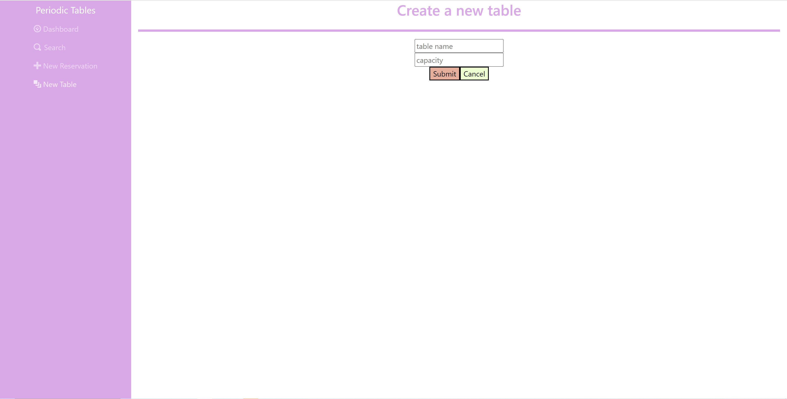

# Installation
1. Run npm install under the root folder to install project dependencies.
2. Run npm run start to start your server
## website ##
www.https://guarded-taiga-31980.herokuapp.com/dashboard
### Features ###
The main focus of this application is to allow the user to easily manage guests. The main features include:
1.Create: You can head to the top right of the dashboard and click "New Reservation" which will prompt a screen that allows you to create a detailed reservation:

2.Edit: Once a reservation has been created you will be redirected to the dashboard page of the date of that reservation. The reservation card on that page will include options to seat, edit, or cancel your reservation.

Upon clicking edit, will direct you to the initial form upon which you created the reservation, with all fields filled with current and editable information:

3.Delete: If you wish to click the cancel button on the reservation, you will be prompted with the following message which will either delete the reservation or cancel the request to delete it:

4.Assigning Tables to Reservations: Clicking the "seat" button will allow you to assign this reservation a table:

Once the reservation at any table is done with their table you can click the "finish" button to clear the table to be available for other reservations:

5.Additional Features: Creating new tables: On the top right of the dashboard there is a nav link for creating new tables. Upon clicking the new table option you will be prompted to a new screen where you can create a new table and submit it to be available for reservations:

Searching a Reservation by Phone Number: Upon clicking the search button on the top of the dashboard you will be prompted to a page where you can input a phone number that will retreive and list all reservations associated with that number:

  
